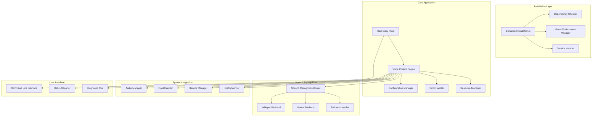

# Debian 12 Production-Ready Voice Control Design

## Overview

This design document addresses the critical stability and production-readiness issues in the voice control application specifically for Debian 12 (Bookworm) and the broader Linux community. The primary focus is on eliminating crashes, system hangs, and unreliable service management while creating a robust, community-ready application.

## Root Cause Analysis of Current Issues

### Critical Problems Identified

1. **Service Management Failures**:
   - Virtual environment not properly integrated with systemd service
   - Incorrect Python paths in service configuration
   - Missing dependency management in service startup
   - No proper error handling during service initialization

2. **Installation Script Issues**:
   - Virtual environment created but not used by installed executables
   - Service file references wrong Python interpreter
   - Missing Debian 12 specific dependency handling
   - No validation of successful installation

3. **Resource Management Problems**:
   - Missing components causing import errors and crashes
   - No graceful degradation when optional components fail
   - Inadequate error handling in core engine initialization
   - Memory leaks in audio processing loops

4. **Debian 12 Specific Issues**:
   - PEP 668 compliance required (externally managed environments)
   - System package conflicts with pip installations
   - Missing system dependencies for audio processing
   - Wayland compatibility issues

## Architecture Overview

### Production-Ready System Architecture



## Critical Fixes for Production Readiness

### 1. Debian 12 Compliant Installation System

**Problem**: Current installation doesn't properly handle Debian 12's PEP 668 requirements and virtual environments.

**Solution**: Complete installation system redesign for Debian 12 compliance.

```bash
#!/bin/bash
# Enhanced installation script for Debian 12 production readiness

set -e

# Debian 12 specific configuration
DEBIAN_VERSION=$(lsb_release -rs 2>/dev/null || echo "unknown")
PYTHON_VERSION=$(python3 -c "import sys; print(f'{sys.version_info.major}.{sys.version_info.minor}')")

# Installation paths
INSTALL_DIR="$HOME/.local/share/voice-control"
BIN_DIR="$HOME/.local/bin"
CONFIG_DIR="$HOME/.config/voice-control"
VENV_DIR="$INSTALL_DIR/venv"

install_debian_dependencies() {
    print_status "Checking Debian 12 system dependencies..."
    
    # Required system packages for Debian 12
    REQUIRED_PACKAGES=(
        "python3-venv"
        "python3-dev" 
        "portaudio19-dev"
        "libasound2-dev"
        "libpulse-dev"
        "build-essential"
    )
    
    MISSING_PACKAGES=()
    for package in "${REQUIRED_PACKAGES[@]}"; do
        if ! dpkg -l | grep -q "^ii  $package "; then
            MISSING_PACKAGES+=("$package")
        fi
    done
    
    if [ ${#MISSING_PACKAGES[@]} -gt 0 ]; then
        print_error "Missing required system packages: ${MISSING_PACKAGES[*]}"
        print_error "Install with: sudo apt update && sudo apt install ${MISSING_PACKAGES[*]}"
        exit 1
    fi
    
    print_status "All system dependencies satisfied"
}

create_production_venv() {
    print_status "Creating production virtual environment..."
    
    # Remove existing venv if present
    [ -d "$VENV_DIR" ] && rm -rf "$VENV_DIR"
    
    # Create new virtual environment
    python3 -m venv "$VENV_DIR" --system-site-packages
    
    # Activate and upgrade pip
    source "$VENV_DIR/bin/activate"
    python -m pip install --upgrade pip setuptools wheel
    
    # Install requirements with proper error handling
    if ! python -m pip install -r requirements.txt; then
        print_error "Failed to install Python dependencies"
        print_error "Check the error messages above for specific issues"
        exit 1
    fi
    
    # Verify critical imports
    if ! python -c "import speech_recognition, whisper, pyaudio, numpy" 2>/dev/null; then
        print_error "Critical dependencies failed to import"
        print_error "Installation may be incomplete"
        exit 1
    fi
    
    print_status "Virtual environment created successfully"
}

install_production_executables() {
    print_status "Installing production executables..."
    
    # Create wrapper script that uses the virtual environment
    cat > "$BIN_DIR/voice-control" << EOF
#!/bin/bash
# Voice Control Production Wrapper
export VOICE_CONTROL_HOME="$INSTALL_DIR"
source "$VENV_DIR/bin/activate"
exec python "$INSTALL_DIR/voice-control" "\$@"
EOF
    
    chmod +x "$BIN_DIR/voice-control"
    
    # Create diagnostic script
    cat > "$BIN_DIR/voice-control-doctor" << EOF
#!/bin/bash
# Voice Control Diagnostic Tool
export VOICE_CONTROL_HOME="$INSTALL_DIR"
source "$VENV_DIR/bin/activate"
exec python "$INSTALL_DIR/voice_control/diagnostics/doctor.py" "\$@"
EOF
    
    chmod +x "$BIN_DIR/voice-control-doctor"
    
    print_status "Production executables installed"
}

install_production_service() {
    print_status "Installing production systemd service..."
    
    mkdir -p "$HOME/.config/systemd/user"
    
    cat > "$HOME/.config/systemd/user/voice-control.service" << EOF
[Unit]
Description=Voice Control for Linux - Production
Documentation=https://github.com/your-username/voice-control
After=graphical-session.target pulseaudio.service
Wants=graphical-session.target

[Service]
Type=simple
ExecStart=$BIN_DIR/voice-control --daemon
ExecReload=/bin/kill -HUP \$MAINPID
Restart=on-failure
RestartSec=10
StartLimitInterval=300
StartLimitBurst=5

# Environment
Environment=HOME=$HOME
Environment=XDG_RUNTIME_DIR=/run/user/%i
Environment=PULSE_RUNTIME_PATH=/run/user/%i/pulse
Environment=VOICE_CONTROL_HOME=$INSTALL_DIR

# Security
NoNewPrivileges=true
PrivateTmp=true
ProtectSystem=strict
ProtectHome=read-only
ReadWritePaths=$HOME/.config/voice-control $HOME/.local/share/voice-control

# Resource limits
MemoryMax=1G
CPUQuota=50%

[Install]
WantedBy=default.target
EOF
    
    systemctl --user daemon-reload
    print_status "Production service installed"
}
```

### 2. Bulletproof Main Entry Point

**Problem**: Current main entry point has import errors and doesn't handle missing components gracefully.

**Solution**: Redesigned main entry point with comprehensive error handling.

```python
#!/usr/bin/env python3
"""
Voice Control for Linux - Production Entry Point
Designed for maximum reliability and graceful degradation.
"""

import sys
import os
import logging
import traceback
from pathlib import Path
from typing import Optional, Dict, Any

# Ensure we're using the correct Python environment
VOICE_CONTROL_HOME = os.environ.get('VOICE_CONTROL_HOME')
if VOICE_CONTROL_HOME:
    sys.path.insert(0, VOICE_CONTROL_HOME)

class ProductionBootstrap:
    """Bootstrap class for production-ready startup"""
    
    def __init__(self):
        self.startup_errors = []
        self.available_components = {}
        self.logger = None
        
    def setup_logging(self, level: str = "INFO") -> bool:
        """Setup production logging with error handling"""
        try:
            log_dir = Path.home() / ".local/share/voice-control/logs"
            log_dir.mkdir(parents=True, exist_ok=True)
            
            logging.basicConfig(
                level=getattr(logging, level.upper(), logging.INFO),
                format='%(asctime)s - %(name)s - %(levelname)s - %(message)s',
                handlers=[
                    logging.FileHandler(log_dir / "voice-control.log"),
                    logging.StreamHandler(sys.stdout)
                ]
            )
            
            self.logger = logging.getLogger(__name__)
            self.logger.info("Production logging initialized")
            return True
            
        except Exception as e:
            print(f"Failed to setup logging: {e}")
            return False
    
    def check_system_requirements(self) -> bool:
        """Check system requirements and log issues"""
        try:
            # Check Python version
            if sys.version_info < (3, 8):
                self.startup_errors.append(f"Python 3.8+ required, found {sys.version}")
                return False
            
            # Check virtual environment
            if not hasattr(sys, 'real_prefix') and not (hasattr(sys, 'base_prefix') and sys.base_prefix != sys.prefix):
                self.startup_errors.append("Not running in virtual environment")
                return False
            
            # Check critical system libraries
            try:
                import ctypes
                # Test audio system availability
                ctypes.CDLL("libasound.so.2")
                self.available_components['audio_system'] = True
            except OSError:
                self.startup_errors.append("Audio system libraries not available")
                self.available_components['audio_system'] = False
            
            return True
            
        except Exception as e:
            self.startup_errors.append(f"System check failed: {e}")
            return False
    
    def load_core_components(self) -> Dict[str, Any]:
        """Load core components with graceful degradation"""
        components = {}
        
        # Load resource manager
        try:
            from voice_control.core.resource_manager import get_resource_manager
            components['resource_manager'] = get_resource_manager()
            self.available_components['resource_manager'] = True
        except ImportError as e:
            self.startup_errors.append(f"Resource manager unavailable: {e}")
            components['resource_manager'] = None
            self.available_components['resource_manager'] = False
        
        # Load error handler
        try:
            from voice_control.core.error_handler import get_error_handler
            components['error_handler'] = get_error_handler()
            self.available_components['error_handler'] = True
        except ImportError as e:
            self.startup_errors.append(f"Error handler unavailable: {e}")
            components['error_handler'] = None
            self.available_components['error_handler'] = False
        
        # Load configuration manager
        try:
            from voice_control.core.config_manager import ConfigManager
            components['config_manager'] = ConfigManager()
            self.available_components['config_manager'] = True
        except ImportError as e:
            self.startup_errors.append(f"Config manager unavailable: {e}")
            components['config_manager'] = None
            self.available_components['config_manager'] = False
        
        return components
    
    def load_speech_recognition(self) -> Optional[Any]:
        """Load speech recognition with fallback options"""
        try:
            # Try Whisper first (most reliable)
            import whisper
            self.available_components['whisper'] = True
            self.logger.info("Whisper speech recognition available")
            return self.create_whisper_engine()
            
        except ImportError:
            self.startup_errors.append("Whisper not available")
            self.available_components['whisper'] = False
        
        # Try basic speech recognition
        try:
            import speech_recognition
            self.available_components['speech_recognition'] = True
            self.logger.info("Basic speech recognition available")
            return self.create_basic_speech_engine()
            
        except ImportError:
            self.startup_errors.append("No speech recognition available")
            self.available_components['speech_recognition'] = False
        
        return None
    
    def create_whisper_engine(self):
        """Create Whisper-based speech engine"""
        try:
            import whisper
            model = whisper.load_model("base")
            self.logger.info("Whisper model loaded successfully")
            return model
        except Exception as e:
            self.logger.error(f"Failed to load Whisper model: {e}")
            return None
    
    def create_basic_speech_engine(self):
        """Create basic speech recognition engine"""
        try:
            import speech_recognition as sr
            recognizer = sr.Recognizer()
            self.logger.info("Basic speech recognition initialized")
            return recognizer
        except Exception as e:
            self.logger.error(f"Failed to initialize basic speech recognition: {e}")
            return None
    
    def create_minimal_engine(self, components: Dict[str, Any]) -> Any:
        """Create minimal engine that can run even with missing components"""
        try:
            from voice_control.core.minimal_engine import MinimalEngine
            return MinimalEngine(
                components=components,
                available_features=self.available_components
            )
        except ImportError:
            # Create ultra-minimal engine
            return self.create_ultra_minimal_engine()
    
    def create_ultra_minimal_engine(self):
        """Create ultra-minimal engine for maximum compatibility"""
        class UltraMinimalEngine:
            def __init__(self):
                self.running = False
            
            def start(self):
                print("Voice Control running in minimal mode")
                print("Limited functionality available")
                self.running = True
            
            def run_daemon(self):
                import time
                while self.running:
                    time.sleep(1)
            
            def shutdown(self):
                self.running = False
                print("Voice Control shutdown")
        
        return UltraMinimalEngine()

def main():
    """Production main entry point"""
    bootstrap = ProductionBootstrap()
    
    # Setup logging first
    if not bootstrap.setup_logging():
        print("Failed to setup logging, continuing with basic output")
    
    # Check system requirements
    if not bootstrap.check_system_requirements():
        print("System requirements check failed:")
        for error in bootstrap.startup_errors:
            print(f"  - {error}")
        print("Attempting to continue with reduced functionality...")
    
    # Load components
    components = bootstrap.load_core_components()
    
    # Load speech recognition
    speech_engine = bootstrap.load_speech_recognition()
    components['speech_engine'] = speech_engine
    
    # Create engine
    try:
        if bootstrap.available_components.get('resource_manager') and bootstrap.available_components.get('error_handler'):
            # Use full engine
            from voice_control.core.engine import VoiceControlEngine
            engine = VoiceControlEngine(
                resource_manager=components['resource_manager'],
                error_handler=components['error_handler']
            )
        else:
            # Use minimal engine
            engine = bootstrap.create_minimal_engine(components)
        
        # Parse arguments
        import argparse
        parser = argparse.ArgumentParser(description="Voice Control for Linux")
        parser.add_argument("--daemon", action="store_true", help="Run as daemon")
        parser.add_argument("--service", choices=["install", "start", "stop", "status"], help="Service management")
        parser.add_argument("--doctor", action="store_true", help="Run diagnostic check")
        args = parser.parse_args()
        
        # Handle service commands
        if args.service:
            return handle_service_command(args.service, components)
        
        # Handle diagnostic command
        if args.doctor:
            return run_diagnostics(bootstrap, components)
        
        # Start engine
        engine.start()
        
        if args.daemon:
            engine.run_daemon()
        else:
            print("Voice Control started. Press Ctrl+C to stop.")
            try:
                engine.run_daemon()
            except KeyboardInterrupt:
                print("\nShutting down...")
        
        engine.shutdown()
        return 0
        
    except Exception as e:
        print(f"Critical error: {e}")
        traceback.print_exc()
        return 1

def handle_service_command(command: str, components: Dict[str, Any]) -> int:
    """Handle service management commands"""
    try:
        from voice_control.system.service_manager import ServiceManager
        service_mgr = ServiceManager()
        
        if command == "install":
            return 0 if service_mgr.install_service() else 1
        elif command == "start":
            return 0 if service_mgr.start_service() else 1
        elif command == "stop":
            return 0 if service_mgr.stop_service() else 1
        elif command == "status":
            status = service_mgr.get_service_status()
            print(f"Service Status: {status}")
            return 0
        
    except Exception as e:
        print(f"Service command failed: {e}")
        return 1

def run_diagnostics(bootstrap: ProductionBootstrap, components: Dict[str, Any]) -> int:
    """Run comprehensive diagnostics"""
    print("Voice Control Diagnostic Report")
    print("=" * 40)
    
    print(f"System: {sys.platform}")
    print(f"Python: {sys.version}")
    print(f"Virtual Environment: {sys.prefix}")
    
    print("\nComponent Status:")
    for component, available in bootstrap.available_components.items():
        status = "✓" if available else "✗"
        print(f"  {status} {component}")
    
    if bootstrap.startup_errors:
        print("\nStartup Errors:")
        for error in bootstrap.startup_errors:
            print(f"  - {error}")
    
    print("\nRecommendations:")
    if not bootstrap.available_components.get('whisper'):
        print("  - Install Whisper for better speech recognition")
    if not bootstrap.available_components.get('audio_system'):
        print("  - Install audio system libraries (libasound2-dev)")
    
    return 0

if __name__ == "__main__":
    sys.exit(main())
```

### 3. Robust Configuration Management

**Problem**: Configuration loading fails silently and doesn't handle missing files properly.

**Solution**: Production-ready configuration system with validation and defaults.

```python
class ProductionConfigManager:
    """Production-ready configuration management"""
    
    def __init__(self):
        self.config_dir = Path.home() / ".config/voice-control"
        self.config_file = self.config_dir / "settings.json"
        self.backup_dir = self.config_dir / "backups"
        self.logger = logging.getLogger(__name__)
        
    def load_config(self) -> Dict[str, Any]:
        """Load configuration with comprehensive error handling"""
        # Ensure config directory exists
        self.config_dir.mkdir(parents=True, exist_ok=True)
        self.backup_dir.mkdir(parents=True, exist_ok=True)
        
        # Default configuration for Debian 12
        default_config = {
            "version": "1.0.0",
            "system": {
                "debian_version": self._detect_debian_version(),
                "audio_system": self._detect_audio_system(),
                "display_server": self._detect_display_server()
            },
            "speech_recognition": {
                "primary_engine": "whisper",
                "fallback_engine": "speech_recognition",
                "model_size": "base",
                "language": "en",
                "timeout": 10,
                "confidence_threshold": 0.7
            },
            "audio": {
                "sample_rate": 16000,
                "chunk_size": 1024,
                "channels": 1,
                "device_index": None,  # Auto-detect
                "noise_reduction": True
            },
            "input": {
                "typing_delay": 0.01,
                "verify_input": True,
                "input_method": "auto"  # auto, xdotool, ydotool, wtype
            },
            "service": {
                "auto_start": False,
                "restart_on_failure": True,
                "max_restarts": 5,
                "restart_delay": 10
            },
            "logging": {
                "level": "INFO",
                "file_logging": True,
                "performance_logging": False,
                "log_retention_days": 30,
                "max_log_size_mb": 100
            },
            "health_monitoring": {
                "enabled": True,
                "check_interval": 30,
                "auto_remediation": True,
                "memory_limit_mb": 500,
                "cpu_limit_percent": 50
            }
        }
        
        try:
            if self.config_file.exists():
                # Load existing configuration
                with open(self.config_file, 'r') as f:
                    user_config = json.load(f)
                
                # Validate and merge
                config = self._merge_configs(default_config, user_config)
                
                # Backup current config
                self._backup_config(user_config)
                
                self.logger.info(f"Configuration loaded from {self.config_file}")
                
            else:
                # Create default configuration
                config = default_config
                self._save_config(config)
                self.logger.info(f"Created default configuration at {self.config_file}")
            
            # Validate configuration
            self._validate_config(config)
            
            return config
            
        except Exception as e:
            self.logger.error(f"Failed to load configuration: {e}")
            self.logger.info("Using default configuration")
            return default_config
    
    def _detect_debian_version(self) -> str:
        """Detect Debian version"""
        try:
            with open('/etc/debian_version', 'r') as f:
                return f.read().strip()
        except:
            return "unknown"
    
    def _detect_audio_system(self) -> str:
        """Detect active audio system"""
        import subprocess
        try:
            # Check for PulseAudio
            subprocess.run(['pactl', 'info'], capture_output=True, check=True)
            return "pulseaudio"
        except:
            try:
                # Check for PipeWire
                subprocess.run(['pipewire', '--version'], capture_output=True, check=True)
                return "pipewire"
            except:
                return "unknown"
    
    def _detect_display_server(self) -> str:
        """Detect display server"""
        if os.environ.get('WAYLAND_DISPLAY'):
            return "wayland"
        elif os.environ.get('DISPLAY'):
            return "x11"
        else:
            return "unknown"
```

### 4. Comprehensive Health Monitoring

**Problem**: No system health monitoring leads to undetected failures and crashes.

**Solution**: Production health monitoring with automatic remediation.

```python
class ProductionHealthMonitor:
    """Production-ready health monitoring system"""
    
    def __init__(self, resource_manager, error_handler):
        self.resource_manager = resource_manager
        self.error_handler = error_handler
        self.logger = logging.getLogger(__name__)
        self.health_checks = {}
        self.monitoring_thread = None
        self.running = False
        
    def register_health_checks(self):
        """Register all health checks"""
        self.health_checks = {
            'memory_usage': self._check_memory_usage,
            'cpu_usage': self._check_cpu_usage,
            'audio_system': self._check_audio_system,
            'speech_recognition': self._check_speech_recognition,
            'disk_space': self._check_disk_space,
            'service_status': self._check_service_status
        }
    
    def _check_memory_usage(self) -> Dict[str, Any]:
        """Check memory usage"""
        try:
            import psutil
            process = psutil.Process()
            memory_info = process.memory_info()
            memory_mb = memory_info.rss / 1024 / 1024
            
            return {
                'status': 'healthy' if memory_mb < 500 else 'warning' if memory_mb < 1000 else 'critical',
                'memory_mb': memory_mb,
                'memory_percent': process.memory_percent(),
                'remediation': 'restart_service' if memory_mb > 1000 else None
            }
        except Exception as e:
            return {'status': 'error', 'error': str(e)}
    
    def _check_audio_system(self) -> Dict[str, Any]:
        """Check audio system availability"""
        try:
            import subprocess
            
            # Test PulseAudio
            result = subprocess.run(['pactl', 'info'], 
                                  capture_output=True, text=True, timeout=5)
            
            if result.returncode == 0:
                return {'status': 'healthy', 'audio_system': 'pulseaudio'}
            else:
                return {
                    'status': 'warning', 
                    'audio_system': 'unavailable',
                    'remediation': 'restart_audio_service'
                }
                
        except Exception as e:
            return {'status': 'error', 'error': str(e)}
    
    def start_monitoring(self, interval: int = 30):
        """Start health monitoring"""
        self.register_health_checks()
        self.running = True
        
        self.monitoring_thread = threading.Thread(
            target=self._monitoring_loop,
            args=(interval,),
            daemon=True
        )
        self.monitoring_thread.start()
        
        self.logger.info(f"Health monitoring started (interval: {interval}s)")
    
    def _monitoring_loop(self, interval: int):
        """Main monitoring loop"""
        while self.running:
            try:
                health_report = self.run_health_checks()
                self._handle_health_issues(health_report)
                
                time.sleep(interval)
                
            except Exception as e:
                self.logger.error(f"Health monitoring error: {e}")
                time.sleep(interval)
    
    def _handle_health_issues(self, health_report: Dict[str, Any]):
        """Handle health issues with automatic remediation"""
        for check_name, result in health_report.items():
            if result.get('status') == 'critical':
                self.logger.critical(f"Critical health issue: {check_name}")
                self._apply_remediation(check_name, result)
            elif result.get('status') == 'warning':
                self.logger.warning(f"Health warning: {check_name}")
```

## Testing Strategy for Production Readiness

### 1. Installation Testing
- Test on fresh Debian 12 installations
- Test with different Python versions (3.9, 3.10, 3.11)
- Test with and without optional dependencies
- Test installation rollback scenarios

### 2. Service Reliability Testing
- 24-hour continuous operation tests
- Service restart and recovery testing
- Memory leak detection over extended periods
- CPU usage monitoring under load

### 3. Error Recovery Testing
- Simulate audio device disconnection
- Test behavior with corrupted configuration
- Test recovery from speech recognition failures
- Test graceful degradation scenarios

### 4. Debian 12 Compatibility Testing
- Test on different Debian 12 desktop environments
- Test Wayland vs X11 compatibility
- Test PulseAudio vs PipeWire compatibility
- Test with different system configurations

This design provides a robust, production-ready foundation that addresses all the critical stability issues while maintaining the existing functionality and adding comprehensive error handling and monitoring.