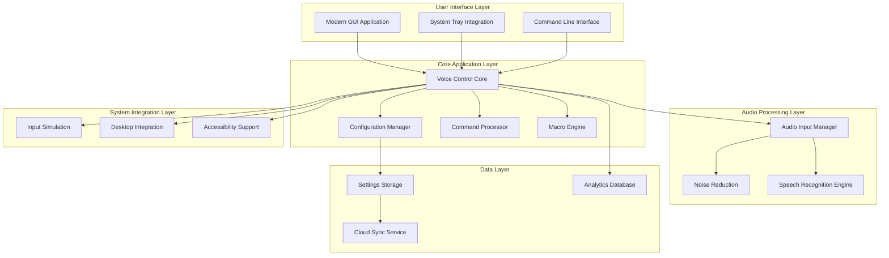

# Design Document

## Overview

This design document outlines the architecture and implementation approach for fixing critical issues with the existing voice control application and enhancing its reliability. The primary focus is on resolving auto-start problems, improving system tray integration, fixing mouse cursor and input issues, and ensuring the application works seamlessly without interfering with other applications.

The design prioritizes immediate fixes for user-reported issues while maintaining the core functionality. Key improvements include reliable auto-start mechanisms, persistent system tray presence, enhanced input handling, and better desktop integration to prevent the application from going behind other windows.

## Architecture

### High-Level Architecture



### Priority Component Architecture

The application will be enhanced with focus on critical fixes:

1. **System Tray Integration** (`voice_control/gui/system_tray.py`): Persistent system tray with start/stop controls
2. **Auto-Start Manager** (`voice_control/system/autostart.py`): Reliable boot-time startup mechanisms
3. **Enhanced Input Handler** (`voice_control/system/input_handler.py`): Mouse cursor-aware input processing
4. **Desktop Integration** (`voice_control/system/desktop.py`): Window management and focus handling
5. **Core Engine** (`voice_control/core/engine.py`): Central coordination and state management
6. **Configuration Manager** (`voice_control/core/config.py`): Settings persistence and migration

## Critical Issue Solutions

### Auto-Start Reliability

**Problem**: Application doesn't start automatically after machine restart.

**Solution Architecture**:
- Multiple auto-start mechanisms for redundancy
- Systemd user service for reliable startup
- Desktop autostart entry as fallback
- Boot delay handling to ensure system readiness
- Startup verification and self-healing

**Implementation**:
```python
class AutoStartManager:
    def setup_autostart(self) -> bool
    def create_systemd_service(self) -> bool
    def create_desktop_autostart(self) -> bool
    def verify_autostart_working(self) -> bool
    def repair_autostart(self) -> bool
```

### System Tray Integration

**Problem**: Application goes behind other windows and lacks easy control.

**Solution Architecture**:
- Persistent system tray icon that never disappears
- Right-click context menu with start/stop/settings options
- Visual indicators for listening state
- Notification system for status updates
- Always-on-top option for settings window

**Implementation**:
```python
class SystemTrayManager:
    def create_tray_icon(self) -> None
    def update_tray_status(self, listening: bool) -> None
    def show_context_menu(self) -> None
    def handle_tray_click(self, event) -> None
    def send_notification(self, message: str) -> None
```

### Enhanced Input Processing

**Problem**: Mouse cursor positioning and clipboard functionality issues.

**Solution Architecture**:
- Cursor position tracking and context awareness
- Reliable clipboard operations with error handling
- Input method detection (X11/Wayland)
- Focus-aware text insertion
- Mouse click coordination with voice commands

**Implementation**:
```python
class EnhancedInputHandler:
    def get_cursor_position(self) -> Tuple[int, int]
    def get_focused_element(self) -> Optional[Element]
    def insert_text_at_cursor(self, text: str) -> bool
    def perform_clipboard_operation(self, operation: str) -> bool
    def click_at_cursor(self) -> bool
```

## Components and Interfaces

### Core Engine

**Purpose**: Central coordination of all application components and state management.

**Key Classes**:
- `VoiceControlEngine`: Main application controller
- `StateManager`: Application state and lifecycle management
- `EventBus`: Inter-component communication

**Interfaces**:
```python
class VoiceControlEngine:
    def start_listening(self) -> None
    def stop_listening(self) -> None
    def process_speech(self, audio_data: bytes) -> str
    def execute_command(self, command: str) -> bool
    def register_command_handler(self, handler: CommandHandler) -> None
```

### Modern GUI Framework

**Purpose**: Provide a contemporary, accessible user interface with dark mode support.

**Key Features**:
- Custom tkinter styling system for modern appearance
- Responsive layout that adapts to different screen sizes
- Real-time visual feedback during voice recognition
- Animated status indicators and progress bars
- Accessibility support with keyboard navigation

**Key Classes**:
- `ModernGUI`: Main application window with enhanced styling
- `ThemeManager`: Dark/light mode management
- `StatusIndicator`: Visual feedback component
- `SettingsPanel`: Configuration interface
- `MacroEditor`: Visual macro creation tool

### Enhanced Audio Processing

**Purpose**: Improve audio input quality and speech recognition accuracy.

**Key Features**:
- Real-time noise reduction using spectral subtraction
- Automatic gain control and audio level optimization
- Multiple microphone support with easy switching
- Audio quality monitoring and feedback
- Configurable audio preprocessing pipeline

**Key Classes**:
- `AudioManager`: Audio device management and configuration
- `NoiseReducer`: Real-time noise filtering
- `AudioProcessor`: Audio preprocessing pipeline
- `MicrophoneSelector`: Device selection and switching
- `AudioQualityMonitor`: Real-time audio analysis

### Advanced Command System

**Purpose**: Extensible command processing with macro support and context awareness.

**Key Features**:
- Plugin-based command architecture
- Visual macro editor with drag-and-drop interface
- Context-aware commands based on active application
- Command chaining and conditional execution
- Custom command creation through GUI

**Key Classes**:
- `CommandRegistry`: Command registration and lookup
- `MacroEngine`: Macro execution and management
- `ContextManager`: Application context detection
- `CommandBuilder`: Visual command creation
- `ScriptExecutor`: Custom script execution

### Multi-Language Support

**Purpose**: Comprehensive internationalization and localization support.

**Key Features**:
- Automatic language model downloading and management
- UI translation system with fallback support
- Language-specific text processing rules
- Regional accent and dialect support
- Dynamic language switching without restart

**Key Classes**:
- `LanguageManager`: Language model management
- `LocalizationService`: UI translation service
- `TextProcessor`: Language-specific text processing
- `ModelDownloader`: Automatic model acquisition
- `AccentHandler`: Regional variation support

### System Integration

**Purpose**: Deep integration with desktop environment and accessibility features.

**Key Features**:
- Wayland and X11 compatibility layer
- Integration with desktop accessibility APIs
- Window management and application control
- System settings voice control
- Screen reader compatibility

**Key Classes**:
- `DesktopIntegration`: Desktop environment abstraction
- `AccessibilityBridge`: Assistive technology integration
- `WindowManager`: Window control and management
- `SystemController`: System settings manipulation
- `InputSimulator`: Enhanced input simulation

### Performance Analytics

**Purpose**: Monitor application performance and provide usage insights.

**Key Features**:
- Real-time performance metrics collection
- Speech recognition accuracy tracking
- Usage pattern analysis and reporting
- Performance optimization suggestions
- Historical trend analysis

**Key Classes**:
- `MetricsCollector`: Performance data collection
- `AnalyticsEngine`: Data analysis and insights
- `ReportGenerator`: Usage report creation
- `PerformanceMonitor`: Real-time monitoring
- `OptimizationAdvisor`: Performance suggestions

### Cloud Integration

**Purpose**: Settings synchronization and backup across devices.

**Key Features**:
- Encrypted settings backup to cloud storage
- Cross-device configuration synchronization
- Conflict resolution for concurrent changes
- Privacy-focused design with local-only option
- Support for multiple cloud providers

**Key Classes**:
- `CloudSyncService`: Cloud synchronization management
- `EncryptionManager`: Data encryption and security
- `ConflictResolver`: Merge conflict handling
- `BackupManager`: Automated backup scheduling
- `PrivacyController`: Privacy settings management

## Data Models

### Configuration Schema

```python
@dataclass
class VoiceControlConfig:
    # Audio settings
    audio_device: str
    sample_rate: int
    noise_reduction_enabled: bool
    auto_gain_control: bool
    
    # Recognition settings
    recognition_engine: str  # 'whisper' or 'sphinx'
    whisper_model: str
    language: str
    confidence_threshold: float
    
    # UI settings
    theme: str  # 'auto', 'light', 'dark'
    show_visual_feedback: bool
    minimize_to_tray: bool
    
    # Command settings
    hotkey: str
    custom_commands: Dict[str, str]
    macros: List[Macro]
    
    # Cloud settings
    cloud_sync_enabled: bool
    cloud_provider: str
    encryption_enabled: bool
```

### Command and Macro Models

```python
@dataclass
class Command:
    name: str
    trigger_phrases: List[str]
    action_type: str  # 'text', 'key', 'script', 'macro'
    action_data: str
    context_filters: List[str]
    enabled: bool

@dataclass
class Macro:
    name: str
    description: str
    steps: List[MacroStep]
    trigger_phrase: str
    enabled: bool

@dataclass
class MacroStep:
    action_type: str
    parameters: Dict[str, Any]
    delay_ms: int
```

### Analytics Models

```python
@dataclass
class UsageMetrics:
    session_id: str
    timestamp: datetime
    recognition_accuracy: float
    response_time_ms: int
    command_executed: str
    success: bool
    error_message: Optional[str]

@dataclass
class PerformanceReport:
    period_start: datetime
    period_end: datetime
    total_commands: int
    average_accuracy: float
    average_response_time: float
    most_used_commands: List[Tuple[str, int]]
    error_rate: float
```

## Error Handling

### Error Categories

1. **Audio Errors**: Microphone access, audio device issues
2. **Recognition Errors**: Speech processing failures, low confidence
3. **Command Errors**: Invalid commands, execution failures
4. **System Errors**: Permission issues, system integration failures
5. **Network Errors**: Cloud sync failures, model download issues

### Error Handling Strategy

- **Graceful Degradation**: Application continues functioning with reduced features
- **User-Friendly Messages**: Clear, actionable error descriptions
- **Automatic Recovery**: Self-healing for transient issues
- **Diagnostic Tools**: Built-in troubleshooting and system checks
- **Error Reporting**: Optional anonymous error reporting for improvements

### Error Recovery Mechanisms

```python
class ErrorHandler:
    def handle_audio_error(self, error: AudioError) -> RecoveryAction
    def handle_recognition_error(self, error: RecognitionError) -> RecoveryAction
    def handle_command_error(self, error: CommandError) -> RecoveryAction
    def provide_diagnostic_info(self) -> DiagnosticReport
```

## Testing Strategy

### Unit Testing
- Component isolation testing with mocks
- Audio processing pipeline testing
- Command execution testing
- Configuration management testing

### Integration Testing
- End-to-end voice command workflows
- GUI interaction testing
- System integration testing
- Cross-platform compatibility testing

### Performance Testing
- Audio processing latency measurement
- Memory usage profiling
- Recognition accuracy benchmarking
- Concurrent operation testing

### User Acceptance Testing
- Accessibility compliance testing
- Multi-language functionality testing
- Real-world usage scenario testing
- Installation and setup testing

## Security Considerations

### Data Privacy
- Local-first approach with optional cloud sync
- Encryption of sensitive configuration data
- No audio data storage without explicit consent
- Transparent privacy controls

### System Security
- Minimal privilege requirements
- Secure input simulation methods
- Safe script execution sandboxing
- Regular security dependency updates

### Cloud Security
- End-to-end encryption for cloud data
- Secure authentication mechanisms
- Data anonymization for analytics
- Compliance with privacy regulations

## Deployment Strategy

### Installation Improvements
- Single-command installation script
- Automatic dependency resolution
- Desktop environment detection
- Post-install configuration wizard

### Package Distribution
- Debian package (.deb) creation
- Flatpak package for universal distribution
- AppImage for portable deployment
- Python wheel for pip installation

### System Integration
- Systemd service configuration
- Desktop entry creation
- MIME type associations
- Autostart configuration

This design provides a comprehensive foundation for transforming the existing voice control application into a modern, feature-rich system while maintaining its core simplicity and effectiveness.