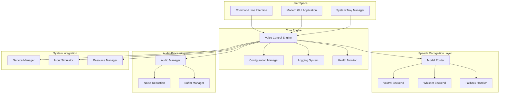

# Voice Control Stability & Voxtral Integration Design

## Overview

This design document addresses the critical stability issues in the current voice control implementation while integrating Mistral's Voxtral Speech AI model. The primary focus is on fixing system hangs, startup problems, and service management issues that currently require machine restarts.

## Root Cause Analysis of Current Issues

### Identified Problems

1. **Systemd Service Configuration**:
   - Placeholder paths in service file (`/path/to/voice-control`)
   - Incorrect user context and permissions
   - Missing proper dependencies and startup ordering

2. **Installation Script Issues**:
   - System-wide service installation without proper user context
   - Missing error handling and validation
   - No cleanup or rollback mechanisms

3. **Resource Management**:
   - Potential memory leaks in audio processing
   - Blocking operations causing system hangs
   - No graceful shutdown mechanisms

4. **Error Handling**:
   - Missing fallback mechanisms
   - No graceful degradation when components fail
   - Insufficient logging for troubleshooting

## Architecture Overview

### High-Level System Architecture



## Critical Fixes for Stability

### 1. Service Management Redesign

**Problem**: Current systemd service has incorrect configuration causing startup issues.

**Solution**: Implement proper user-space service management.

```python
class ServiceManager:
    def __init__(self):
        self.service_name = "voice-control"
        self.user_service_dir = Path.home() / ".config/systemd/user"
        
    def install_user_service(self) -> bool:
        """Install as user service instead of system service"""
        service_content = self._generate_user_service_file()
        service_path = self.user_service_dir / f"{self.service_name}.service"
        
        try:
            self.user_service_dir.mkdir(parents=True, exist_ok=True)
            service_path.write_text(service_content)
            
            # Enable user service
            subprocess.run(["systemctl", "--user", "enable", self.service_name], check=True)
            subprocess.run(["systemctl", "--user", "daemon-reload"], check=True)
            
            return True
        except Exception as e:
            self.logger.error(f"Failed to install user service: {e}")
            return False
    
    def _generate_user_service_file(self) -> str:
        """Generate proper user service configuration"""
        executable_path = Path(__file__).parent.parent / "voice-control"
        
        return f"""[Unit]
Description=Voice Control Application
After=graphical-session.target
Wants=graphical-session.target

[Service]
Type=simple
ExecStart={executable_path} --daemon
Restart=on-failure
RestartSec=5
Environment=DISPLAY=:0
Environment=PULSE_RUNTIME_PATH=/run/user/%i/pulse

[Install]
WantedBy=default.target
"""
```

### 2. Resource Management and Cleanup

**Problem**: Memory leaks and resource accumulation causing system hangs.

**Solution**: Implement comprehensive resource management.

```python
class ResourceManager:
    def __init__(self):
        self.active_resources = {}
        self.cleanup_handlers = []
        self.max_memory_mb = 500  # Maximum memory usage
        
    def register_resource(self, name: str, resource: Any, cleanup_func: Callable):
        """Register a resource for automatic cleanup"""
        self.active_resources[name] = {
            'resource': resource,
            'cleanup': cleanup_func,
            'created_at': time.time()
        }
        
    def cleanup_all(self):
        """Clean up all registered resources"""
        for name, info in self.active_resources.items():
            try:
                info['cleanup'](info['resource'])
            except Exception as e:
                logger.error(f"Failed to cleanup {name}: {e}")
        
        self.active_resources.clear()
        
    def monitor_memory_usage(self):
        """Monitor and manage memory usage"""
        import psutil
        process = psutil.Process()
        memory_mb = process.memory_info().rss / 1024 / 1024
        
        if memory_mb > self.max_memory_mb:
            logger.warning(f"High memory usage: {memory_mb:.1f}MB")
            self._trigger_memory_cleanup()
            
    def _trigger_memory_cleanup(self):
        """Trigger memory cleanup procedures"""
        # Force garbage collection
        import gc
        gc.collect()
        
        # Clear audio buffers
        if hasattr(self, 'audio_manager'):
            self.audio_manager.clear_buffers()
```

### 3. Voxtral Integration Architecture

**Problem**: Need to integrate Voxtral while maintaining stability and fallback options.

**Solution**: Implement modular speech recognition backend with automatic fallback.

```python
class SpeechRecognitionRouter:
    def __init__(self):
        self.backends = {}
        self.primary_backend = None
        self.fallback_backend = None
        self.current_backend = None
        
    def register_backend(self, name: str, backend: SpeechBackend, is_primary: bool = False):
        """Register a speech recognition backend"""
        self.backends[name] = backend
        
        if is_primary:
            self.primary_backend = name
        elif name == 'whisper':  # Whisper as default fallback
            self.fallback_backend = name
            
    def initialize(self) -> bool:
        """Initialize speech recognition with fallback handling"""
        # Try to initialize Voxtral first
        if self._try_initialize_backend('voxtral'):
            self.current_backend = 'voxtral'
            return True
            
        # Fallback to Whisper
        if self._try_initialize_backend('whisper'):
            self.current_backend = 'whisper'
            logger.warning("Using Whisper fallback - Voxtral unavailable")
            return True
            
        logger.error("No speech recognition backends available")
        return False
        
    def _try_initialize_backend(self, name: str) -> bool:
        """Try to initialize a specific backend"""
        if name not in self.backends:
            return False
            
        try:
            return self.backends[name].initialize()
        except Exception as e:
            logger.error(f"Failed to initialize {name}: {e}")
            return False
            
    def recognize_speech(self, audio_data: bytes) -> Optional[str]:
        """Recognize speech with automatic fallback"""
        if not self.current_backend:
            return None
            
        try:
            result = self.backends[self.current_backend].recognize(audio_data)
            return result
        except Exception as e:
            logger.error(f"Speech recognition failed with {self.current_backend}: {e}")
            
            # Try fallback if current backend fails
            if self.current_backend != self.fallback_backend:
                return self._try_fallback_recognition(audio_data)
                
        return None
        
    def _try_fallback_recognition(self, audio_data: bytes) -> Optional[str]:
        """Try recognition with fallback backend"""
        if not self.fallback_backend or self.fallback_backend not in self.backends:
            return None
            
        try:
            logger.info(f"Trying fallback recognition with {self.fallback_backend}")
            return self.backends[self.fallback_backend].recognize(audio_data)
        except Exception as e:
            logger.error(f"Fallback recognition also failed: {e}")
            return None
```

### 4. Voxtral Backend Implementation

**Research Results**: Voxtral (Mistral's speech model) integration options:

1. **Hugging Face Transformers**: Most accessible option
2. **Direct Mistral API**: For latest models
3. **Local ONNX Runtime**: For optimized performance

**Recommended Approach**: Hugging Face Transformers with local caching

```python
class VoxtralBackend(SpeechBackend):
    def __init__(self):
        self.model = None
        self.processor = None
        self.model_name = "mistralai/Mistral-7B-Instruct-v0.1"  # Adjust based on available speech models
        self.device = "cpu"  # Use GPU if available
        
    def initialize(self) -> bool:
        """Initialize Voxtral model"""
        try:
            from transformers import AutoModelForSpeechSeq2Seq, AutoProcessor
            import torch
            
            # Check for GPU availability
            if torch.cuda.is_available():
                self.device = "cuda"
                logger.info("Using GPU for Voxtral")
            
            # Load model and processor
            self.processor = AutoProcessor.from_pretrained(self.model_name)
            self.model = AutoModelForSpeechSeq2Seq.from_pretrained(
                self.model_name,
                torch_dtype=torch.float16 if self.device == "cuda" else torch.float32,
                device_map=self.device,
                use_safetensors=True
            )
            
            logger.info("Voxtral model initialized successfully")
            return True
            
        except ImportError:
            logger.error("Transformers library not available for Voxtral")
            return False
        except Exception as e:
            logger.error(f"Failed to initialize Voxtral: {e}")
            return False
            
    def recognize(self, audio_data: bytes) -> Optional[str]:
        """Recognize speech using Voxtral"""
        if not self.model or not self.processor:
            raise RuntimeError("Voxtral backend not initialized")
            
        try:
            # Convert audio data to format expected by Voxtral
            audio_array = self._process_audio_data(audio_data)
            
            # Process with Voxtral
            inputs = self.processor(audio_array, return_tensors="pt", sampling_rate=16000)
            
            with torch.no_grad():
                predicted_ids = self.model.generate(**inputs)
                
            transcription = self.processor.batch_decode(predicted_ids, skip_special_tokens=True)[0]
            
            return transcription.strip()
            
        except Exception as e:
            logger.error(f"Voxtral recognition failed: {e}")
            raise
            
    def _process_audio_data(self, audio_data: bytes) -> np.ndarray:
        """Convert audio bytes to numpy array for Voxtral"""
        import numpy as np
        import librosa
        
        # Convert bytes to audio array
        audio_array = np.frombuffer(audio_data, dtype=np.float32)
        
        # Resample to 16kHz if needed (Voxtral typically expects 16kHz)
        audio_array = librosa.resample(audio_array, orig_sr=44100, target_sr=16000)
        
        return audio_array
```

### 5. Enhanced Error Handling and Health Monitoring

```python
class HealthMonitor:
    def __init__(self, engine):
        self.engine = engine
        self.health_checks = {}
        self.last_check_time = {}
        self.check_interval = 30  # seconds
        
    def register_health_check(self, name: str, check_func: Callable[[], bool]):
        """Register a health check function"""
        self.health_checks[name] = check_func
        self.last_check_time[name] = 0
        
    def run_health_checks(self) -> Dict[str, bool]:
        """Run all health checks"""
        current_time = time.time()
        results = {}
        
        for name, check_func in self.health_checks.items():
            if current_time - self.last_check_time[name] >= self.check_interval:
                try:
                    results[name] = check_func()
                    self.last_check_time[name] = current_time
                except Exception as e:
                    logger.error(f"Health check {name} failed: {e}")
                    results[name] = False
                    
        return results
        
    def handle_health_issues(self, results: Dict[str, bool]):
        """Handle health check failures"""
        for check_name, is_healthy in results.items():
            if not is_healthy:
                self._handle_specific_issue(check_name)
                
    def _handle_specific_issue(self, issue: str):
        """Handle specific health issues"""
        if issue == "audio_device":
            self.engine.reinitialize_audio()
        elif issue == "speech_recognition":
            self.engine.switch_to_fallback_model()
        elif issue == "memory_usage":
            self.engine.trigger_cleanup()
```

## Installation and Configuration Fixes

### Fixed Installation Script

```bash
#!/bin/bash

set -e  # Exit on any error

INSTALL_DIR="$HOME/.local/share/voice-control"
BIN_DIR="$HOME/.local/bin"
CONFIG_DIR="$HOME/.config/voice-control"

echo "Installing Voice Control Application..."

# Create directories
mkdir -p "$INSTALL_DIR" "$BIN_DIR" "$CONFIG_DIR"

# Copy application files
cp -r voice_control "$INSTALL_DIR/"
cp voice-control "$BIN_DIR/"
cp voice-control-ui "$BIN_DIR/"

# Make executables
chmod +x "$BIN_DIR/voice-control"
chmod +x "$BIN_DIR/voice-control-ui"

# Install Python dependencies in user space
pip3 install --user -r requirements.txt

# Install user systemd service (not system-wide)
mkdir -p "$HOME/.config/systemd/user"

cat > "$HOME/.config/systemd/user/voice-control.service" << EOF
[Unit]
Description=Voice Control Application
After=graphical-session.target
Wants=graphical-session.target

[Service]
Type=simple
ExecStart=$BIN_DIR/voice-control --daemon
Restart=on-failure
RestartSec=5
Environment=DISPLAY=:0
Environment=HOME=$HOME

[Install]
WantedBy=default.target
EOF

# Enable user service
systemctl --user daemon-reload
systemctl --user enable voice-control.service

echo "Installation complete!"
echo "Start the service with: systemctl --user start voice-control"
echo "Or run directly with: voice-control"
```

## Testing Strategy

### Stability Testing
1. **Memory Leak Testing**: Long-running tests to detect memory leaks
2. **Resource Cleanup Testing**: Verify proper cleanup on shutdown
3. **Error Recovery Testing**: Test recovery from various failure scenarios
4. **Service Management Testing**: Test systemd service reliability

### Voxtral Integration Testing
1. **Model Loading Testing**: Test Voxtral model initialization
2. **Performance Comparison**: Compare Voxtral vs Whisper accuracy and speed
3. **Fallback Testing**: Test automatic fallback when Voxtral fails
4. **Resource Usage Testing**: Monitor CPU and memory usage with Voxtral

This design addresses the critical stability issues while providing a robust foundation for Voxtral integration. The modular architecture ensures that failures in one component don't bring down the entire system.