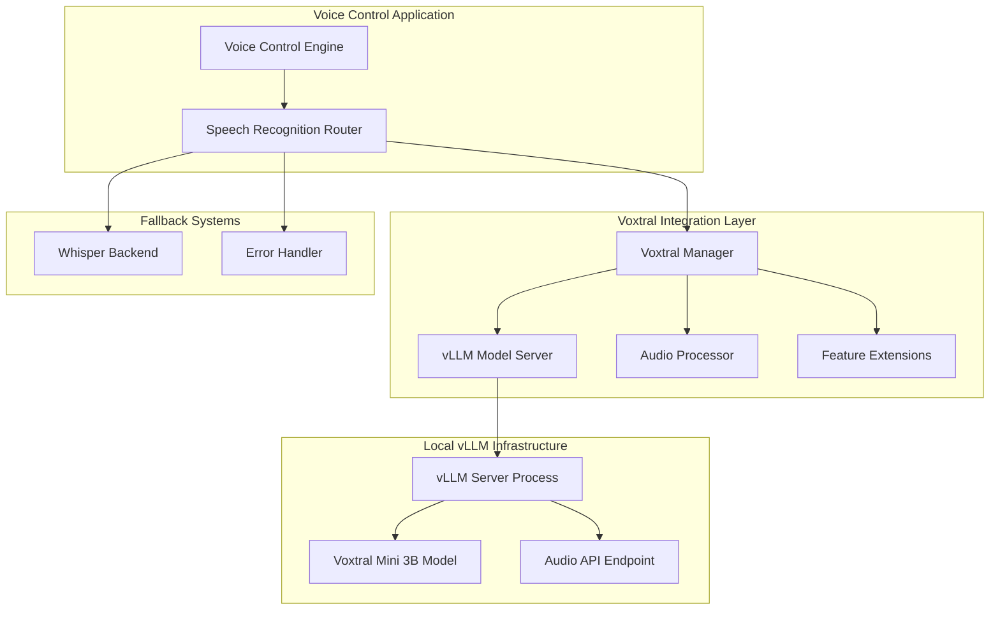

# Voxtral Integration Fixes Design

## Overview

This design document addresses the incorrect Voxtral integration in the current voice control implementation. The current code attempts to use Voxtral through Hugging Face transformers, but Voxtral actually requires local deployment with vLLM. This design focuses on local implementation while creating an extensible architecture for any Voxtral features.

## Current Issues Analysis

### Problems with Current Implementation

1. **Incorrect Integration Method**: Current code tries to load Voxtral as a Hugging Face model
2. **Missing vLLM Dependency**: The proper way to run Voxtral locally requires vLLM with audio support
3. **Wrong Audio Processing**: Current audio preprocessing doesn't match Voxtral's requirements
4. **Missing Model Management**: No proper model downloading and serving infrastructure

### Root Cause

The original implementation was based on assumptions about Voxtral being available through standard transformers library, but Voxtral requires specialized serving infrastructure (vLLM) for optimal performance.

## Architecture Design

### High-Level Architecture



## Core Components Design

### 1. Voxtral Manager

The central component that orchestrates all Voxtral functionality and extensions.

```python
class VoxtralManager:
    def __init__(self, config: VoxtralConfig):
        self.config = config
        self.server_manager = VLLMServerManager(config)
        self.audio_processor = VoxtralAudioProcessor()
        self.feature_registry = VoxtralFeatureRegistry()
        self.client = None
        
    def initialize(self) -> bool:
        """Initialize Voxtral with extensible feature support"""
        try:
            # Start vLLM server if not running
            if not self.server_manager.is_server_running():
                if not self.server_manager.start_server():
                    return False
            
            # Initialize OpenAI-compatible client
            self.client = OpenAI(
                api_key="dummy-key",  # vLLM doesn't require real key
                base_url=f"http://localhost:{self.config.port}/v1"
            )
            
            # Test connection
            if not self._test_connection():
                return False
                
            # Initialize registered features
            self.feature_registry.initialize_features(self.client)
            
            return True
            
        except Exception as e:
            logger.error(f"Failed to initialize Voxtral: {e}")
            return False
    
    def transcribe(self, audio_data: bytes) -> Optional[str]:
        """Core transcription functionality"""
        if not self.client:
            return None
            
        try:
            # Process audio for Voxtral
            processed_audio = self.audio_processor.prepare_audio(audio_data)
            
            # Send to vLLM server
            with tempfile.NamedTemporaryFile(suffix=".wav", delete=False) as tmp_file:
                tmp_file.write(processed_audio)
                tmp_file.flush()
                
                with open(tmp_file.name, "rb") as f:
                    response = self.client.audio.transcriptions.create(
                        file=f,
                        model=self.config.model_name,
                        response_format="text"
                    )
                    
                os.unlink(tmp_file.name)
                return response.text
                
        except Exception as e:
            logger.error(f"Voxtral transcription failed: {e}")
            return None
    
    def execute_feature(self, feature_name: str, audio_data: bytes, **kwargs) -> Any:
        """Execute any registered Voxtral feature"""
        return self.feature_registry.execute_feature(feature_name, audio_data, **kwargs)
    
    def register_feature(self, feature: 'VoxtralFeature'):
        """Register new Voxtral feature for extensibility"""
        self.feature_registry.register(feature)
```

### 2. vLLM Server Manager

Handles the lifecycle of the local vLLM server process.

```python
class VLLMServerManager:
    def __init__(self, config: VoxtralConfig):
        self.config = config
        self.server_process = None
        self.model_path = None
        
    def ensure_model_available(self) -> bool:
        """Download and prepare Voxtral model if needed"""
        try:
            from huggingface_hub import snapshot_download
            
            model_name = "mistralai/Voxtral-Mini-3B-2507"
            cache_dir = Path.home() / ".cache" / "voxtral"
            
            if not (cache_dir / model_name.split('/')[-1]).exists():
                logger.info(f"Downloading Voxtral model: {model_name}")
                self.model_path = snapshot_download(
                    repo_id=model_name,
                    cache_dir=cache_dir,
                    local_files_only=False
                )
            else:
                self.model_path = cache_dir / model_name.split('/')[-1]
                
            return True
            
        except Exception as e:
            logger.error(f"Failed to download Voxtral model: {e}")
            return False
    
    def start_server(self) -> bool:
        """Start vLLM server with Voxtral model"""
        try:
            if not self.ensure_model_available():
                return False
                
            # Check if vLLM is installed
            if not self._check_vllm_installation():
                logger.error("vLLM not installed. Install with: pip install 'vllm[audio]'")
                return False
            
            # Start vLLM server
            cmd = [
                "vllm", "serve",
                "mistralai/Voxtral-Mini-3B-2507",
                "--tokenizer_mode", "mistral",
                "--config_format", "mistral", 
                "--load_format", "mistral",
                "--max-model-len", str(self.config.max_model_len),
                "--port", str(self.config.port),
                "--host", self.config.host
            ]
            
            # Add GPU settings if available
            if torch.cuda.is_available() and self.config.use_gpu:
                cmd.extend(["--tensor-parallel-size", "1"])
            else:
                cmd.extend(["--device", "cpu"])
            
            logger.info(f"Starting vLLM server: {' '.join(cmd)}")
            
            self.server_process = subprocess.Popen(
                cmd,
                stdout=subprocess.PIPE,
                stderr=subprocess.PIPE,
                text=True
            )
            
            # Wait for server to start
            return self._wait_for_server_ready()
            
        except Exception as e:
            logger.error(f"Failed to start vLLM server: {e}")
            return False
    
    def stop_server(self):
        """Stop vLLM server process"""
        if self.server_process:
            self.server_process.terminate()
            self.server_process.wait(timeout=10)
            self.server_process = None
    
    def is_server_running(self) -> bool:
        """Check if vLLM server is running and responsive"""
        try:
            response = requests.get(
                f"http://{self.config.host}:{self.config.port}/health",
                timeout=5
            )
            return response.status_code == 200
        except:
            return False
    
    def _check_vllm_installation(self) -> bool:
        """Check if vLLM with audio support is installed"""
        try:
            import vllm
            # Check for audio support
            from vllm.model_executor.models import voxtral
            return True
        except ImportError:
            return False
    
    def _wait_for_server_ready(self, timeout: int = 120) -> bool:
        """Wait for vLLM server to be ready"""
        start_time = time.time()
        while time.time() - start_time < timeout:
            if self.is_server_running():
                logger.info("vLLM server is ready")
                return True
            time.sleep(2)
        
        logger.error("vLLM server failed to start within timeout")
        return False
```

### 3. Audio Processor

Handles audio preprocessing specifically for Voxtral requirements.

```python
class VoxtralAudioProcessor:
    def __init__(self):
        self.target_sample_rate = 16000  # Voxtral expects 16kHz
        self.target_format = "wav"
        
    def prepare_audio(self, audio_data: bytes) -> bytes:
        """Prepare audio data for Voxtral processing"""
        try:
            import librosa
            import soundfile as sf
            import io
            
            # Load audio from bytes
            audio_array, sample_rate = librosa.load(
                io.BytesIO(audio_data), 
                sr=None
            )
            
            # Resample if needed
            if sample_rate != self.target_sample_rate:
                audio_array = librosa.resample(
                    audio_array, 
                    orig_sr=sample_rate, 
                    target_sr=self.target_sample_rate
                )
            
            # Normalize audio
            audio_array = self._normalize_audio(audio_array)
            
            # Convert to bytes
            output_buffer = io.BytesIO()
            sf.write(
                output_buffer, 
                audio_array, 
                self.target_sample_rate, 
                format='WAV'
            )
            
            return output_buffer.getvalue()
            
        except Exception as e:
            logger.error(f"Audio preprocessing failed: {e}")
            raise
    
    def _normalize_audio(self, audio_array: np.ndarray) -> np.ndarray:
        """Normalize audio to optimal range for Voxtral"""
        # Remove DC offset
        audio_array = audio_array - np.mean(audio_array)
        
        # Normalize to [-1, 1] range
        max_val = np.max(np.abs(audio_array))
        if max_val > 0:
            audio_array = audio_array / max_val * 0.95
            
        return audio_array
```

### 4. Feature Extension System

Extensible system for adding any Voxtral features.

```python
class VoxtralFeature(ABC):
    """Base class for Voxtral feature extensions"""
    
    @property
    @abstractmethod
    def name(self) -> str:
        """Feature name identifier"""
        pass
    
    @property
    @abstractmethod
    def description(self) -> str:
        """Feature description"""
        pass
    
    @abstractmethod
    def execute(self, client: OpenAI, audio_data: bytes, **kwargs) -> Any:
        """Execute the feature"""
        pass
    
    def is_available(self, client: OpenAI) -> bool:
        """Check if feature is available with current setup"""
        return True

class VoxtralTranscriptionFeature(VoxtralFeature):
    """Basic transcription feature"""
    
    @property
    def name(self) -> str:
        return "transcription"
    
    @property
    def description(self) -> str:
        return "Basic audio transcription"
    
    def execute(self, client: OpenAI, audio_data: bytes, **kwargs) -> str:
        with tempfile.NamedTemporaryFile(suffix=".wav", delete=False) as tmp_file:
            tmp_file.write(audio_data)
            tmp_file.flush()
            
            with open(tmp_file.name, "rb") as f:
                response = client.audio.transcriptions.create(
                    file=f,
                    model="mistralai/Voxtral-Mini-3B-2507",
                    response_format="text"
                )
                
            os.unlink(tmp_file.name)
            return response.text

class VoxtralSummarizationFeature(VoxtralFeature):
    """Audio summarization feature"""
    
    @property
    def name(self) -> str:
        return "summarization"
    
    @property
    def description(self) -> str:
        return "Generate summary from audio content"
    
    def execute(self, client: OpenAI, audio_data: bytes, **kwargs) -> str:
        # First transcribe
        transcription = VoxtralTranscriptionFeature().execute(client, audio_data)
        
        # Then summarize using chat completion
        response = client.chat.completions.create(
            model="mistralai/Voxtral-Mini-3B-2507",
            messages=[{
                "role": "user",
                "content": f"Please provide a concise summary of this transcription: {transcription}"
            }],
            temperature=0.3
        )
        
        return response.choices[0].message.content

class VoxtralQAFeature(VoxtralFeature):
    """Question-answering feature"""
    
    @property
    def name(self) -> str:
        return "qa"
    
    @property
    def description(self) -> str:
        return "Answer questions about audio content"
    
    def execute(self, client: OpenAI, audio_data: bytes, **kwargs) -> str:
        question = kwargs.get('question', '')
        if not question:
            raise ValueError("Question is required for QA feature")
        
        # Use multimodal approach - send audio + question
        with tempfile.NamedTemporaryFile(suffix=".wav", delete=False) as tmp_file:
            tmp_file.write(audio_data)
            tmp_file.flush()
            
            # For now, transcribe first then answer
            # Future: Use direct audio+text input when vLLM supports it
            transcription = VoxtralTranscriptionFeature().execute(client, audio_data)
            
            response = client.chat.completions.create(
                model="mistralai/Voxtral-Mini-3B-2507",
                messages=[{
                    "role": "user",
                    "content": f"Based on this transcription: '{transcription}'\n\nQuestion: {question}"
                }],
                temperature=0.2
            )
            
            os.unlink(tmp_file.name)
            return response.choices[0].message.content

class VoxtralFeatureRegistry:
    """Registry for managing Voxtral features"""
    
    def __init__(self):
        self.features: Dict[str, VoxtralFeature] = {}
        self.client = None
        
        # Register default features
        self.register(VoxtralTranscriptionFeature())
        self.register(VoxtralSummarizationFeature())
        self.register(VoxtralQAFeature())
    
    def register(self, feature: VoxtralFeature):
        """Register a new feature"""
        self.features[feature.name] = feature
        logger.info(f"Registered Voxtral feature: {feature.name}")
    
    def initialize_features(self, client: OpenAI):
        """Initialize all features with client"""
        self.client = client
        
        # Test feature availability
        available_features = []
        for name, feature in self.features.items():
            if feature.is_available(client):
                available_features.append(name)
            else:
                logger.warning(f"Feature {name} is not available")
        
        logger.info(f"Available Voxtral features: {available_features}")
    
    def execute_feature(self, feature_name: str, audio_data: bytes, **kwargs) -> Any:
        """Execute a specific feature"""
        if feature_name not in self.features:
            raise ValueError(f"Unknown feature: {feature_name}")
        
        if not self.client:
            raise RuntimeError("Feature registry not initialized")
        
        feature = self.features[feature_name]
        return feature.execute(self.client, audio_data, **kwargs)
    
    def list_features(self) -> List[Dict[str, str]]:
        """List all available features"""
        return [
            {
                "name": feature.name,
                "description": feature.description,
                "available": feature.is_available(self.client) if self.client else False
            }
            for feature in self.features.values()
        ]
```

### 5. Configuration System

```python
@dataclass
class VoxtralConfig:
    # Server configuration
    host: str = "localhost"
    port: int = 8000
    model_name: str = "mistralai/Voxtral-Mini-3B-2507"
    max_model_len: int = 4864
    
    # Hardware configuration
    use_gpu: bool = True
    tensor_parallel_size: int = 1
    
    # Audio configuration
    max_audio_length_seconds: int = 900  # 15 minutes
    chunk_size_seconds: int = 30
    
    # Feature configuration
    enable_summarization: bool = True
    enable_qa: bool = True
    enable_custom_features: bool = True
    
    @classmethod
    def from_dict(cls, config_dict: dict) -> 'VoxtralConfig':
        """Create config from dictionary"""
        return cls(**{k: v for k, v in config_dict.items() if k in cls.__annotations__})
    
    @classmethod
    def get_default_config(cls) -> 'VoxtralConfig':
        """Get default configuration"""
        config = cls()
        
        # Adjust for system capabilities
        if not torch.cuda.is_available():
            config.use_gpu = False
            config.tensor_parallel_size = 1
        
        return config
```

## Integration with Existing System

### Updated Speech Recognition Router

```python
class SpeechRecognitionRouter:
    def __init__(self):
        self.backends = {}
        self.voxtral_manager = None
        
    def initialize(self, config: dict) -> bool:
        """Initialize with Voxtral support"""
        try:
            # Initialize Voxtral if configured
            if 'voxtral' in config:
                voxtral_config = VoxtralConfig.from_dict(config['voxtral'])
                self.voxtral_manager = VoxtralManager(voxtral_config)
                
                if self.voxtral_manager.initialize():
                    self.backends['voxtral'] = self.voxtral_manager
                    logger.info("Voxtral backend initialized successfully")
                else:
                    logger.warning("Voxtral initialization failed, will use fallback")
            
            # Initialize other backends (Whisper, etc.)
            # ... existing code ...
            
            return True
            
        except Exception as e:
            logger.error(f"Failed to initialize speech router: {e}")
            return False
    
    def recognize_speech(self, audio_data: bytes, feature: str = "transcription", **kwargs) -> Optional[str]:
        """Recognize speech with feature support"""
        # Try Voxtral first
        if 'voxtral' in self.backends:
            try:
                if feature == "transcription":
                    return self.voxtral_manager.transcribe(audio_data)
                else:
                    return self.voxtral_manager.execute_feature(feature, audio_data, **kwargs)
            except Exception as e:
                logger.error(f"Voxtral recognition failed: {e}")
        
        # Fallback to other backends
        return self._fallback_recognition(audio_data)
```

## Installation and Setup

### Requirements Update

```txt
# Existing requirements...

# Voxtral-specific requirements
vllm[audio]>=0.3.0
mistral-common>=0.0.12
openai>=1.0.0
torch>=2.0.0
torchaudio>=2.0.0
librosa>=0.10.0
soundfile>=0.12.0
huggingface-hub>=0.19.0
```

### Setup Script

```bash
#!/bin/bash
# setup_voxtral.sh

echo "Setting up Voxtral integration..."

# Install vLLM with audio support
pip install "vllm[audio]" --extra-index-url https://wheels.vllm.ai/nightly

# Install other dependencies
pip install mistral-common openai librosa soundfile huggingface-hub

# Download Voxtral model (optional - will download on first use)
echo "Voxtral model will be downloaded automatically on first use"
echo "To pre-download: python -c 'from huggingface_hub import snapshot_download; snapshot_download(\"mistralai/Voxtral-Mini-3B-2507\")'"

echo "Voxtral setup complete!"
```

This design provides:

1. **Correct vLLM Integration**: Uses proper vLLM serving infrastructure
2. **Extensible Feature System**: Easy to add any new Voxtral capabilities
3. **Local-First Approach**: Runs completely offline with local models
4. **Graceful Fallbacks**: Falls back to Whisper if Voxtral unavailable
5. **Resource Management**: Proper server lifecycle management
6. **Future-Proof**: Ready for new Voxtral features and capabilities

The architecture is designed to be extensible so any new Voxtral features can be easily added as new `VoxtralFeature` implementations.